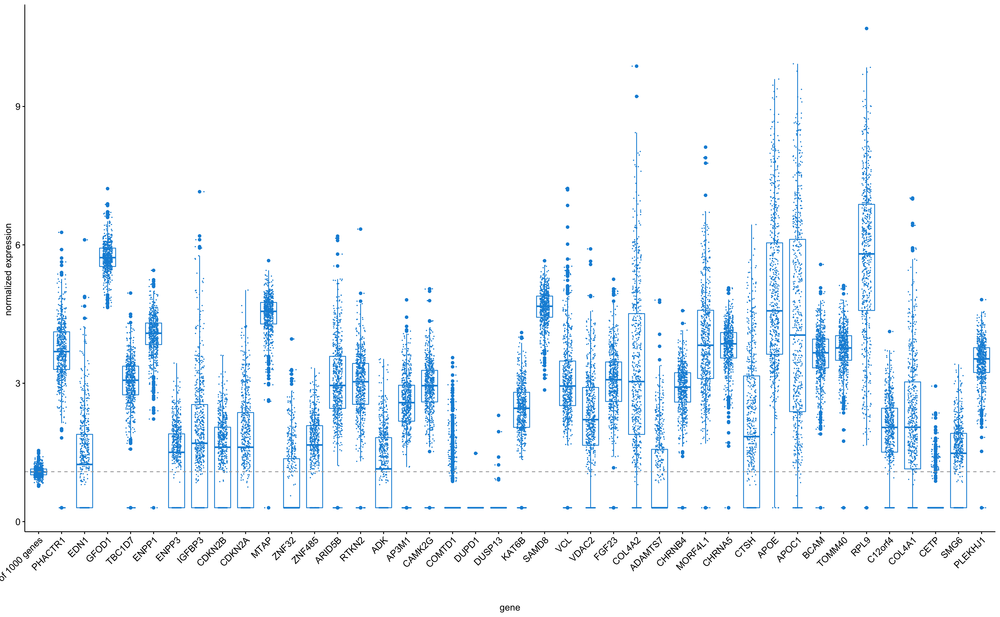
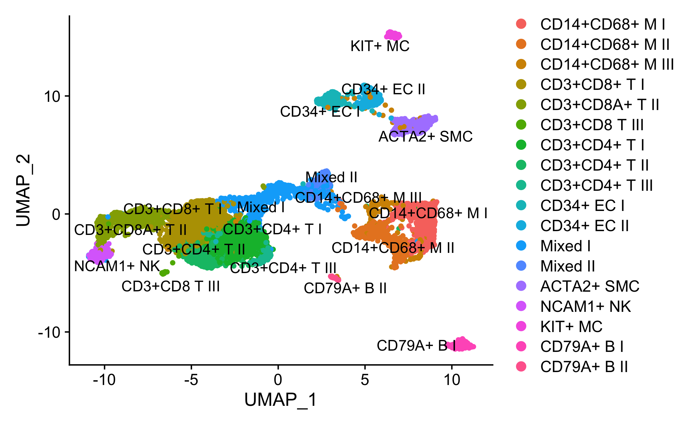
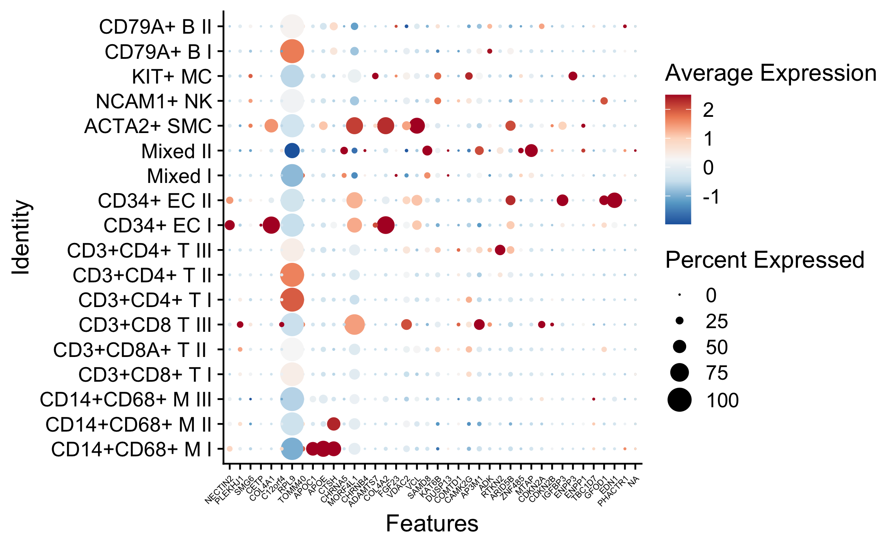

# Mapping CAC susceptibility loci to atherosclerotic plaques

_Project ID_: `AE_20200512_COL_MKAVOUSI_MBOS_CHARGE_1000G_CAC`.

## Background

Collaboration for mapping targets from the CHARGE Consortium 1000G GWAS on _coronary artery calcification (CAC)_ with Maryam Kavousi, Patricia Peyser, and Maxime Bos.

## Athero-Express Biobank Study
We have bulk RNAseq (n = 635 samples) and single-cell RNAseq data, genome-wide methylation (Illumina 450K) in n ± 600, as well as overlapping genetic data for ±2,100 individuals with extensive histological plaque characterisation. We will address the following questions:

- Gene expression correlated to characteristics of plaques?
- Where target genes expressed, which cell types? 
- Are any of the variants associated to plaque characteristics?

Ideally, we would like to map the variants to the expression and methylation data (molecular QTL mapping), but this is pending finalizing our molQTL mapping.

We expect new plasma-based OLINK data (for the 'TO_AITION' projecty) in Q4 2020. We agreed that we would keep this in mind, we could run some additional analyses when asked during the revision stage of the manuscript.

- Correlation of variants to proteins from the OLINK-platform

## Methods

### Mapping genes to single cells 

We will use the last dataset from the scRNAseq data, including 35 individuals, to project target genes. 

### Genetic analyses

For the genetic analyses we will perform regression analyses adjusted for age, sex (where applicable) and principal components. So, we will apply the following model:

model 1: `phenotype ~ age + sex + chip-used + PC1 + PC2 + year-of-surgery`

phenotypes are:

- `calcification`, coded `Calc.bin` no/minor vs. moderate/heavy staining
- `collagen`, coded `Collagen.bin` no/minor vs. moderate/heavy staining
- `fat10`, coded `Fat.bin_10` no/<10% fat vs. >10% fat
- `fat40`, coded `Fat.bin_40` no/<40% fat vs. >40% fat
- `intraplaque hemorrhage`, coded `IPH.bin` no vs. yes
- `macrophages (CD68)`, coded `macmean0` mean of computer-assisted calculation CD68+ region of interest
- `smooth muscle cells (alpha-actin)`, coded `smcmean0` mean of computer-assisted calculation SMA+ region of interest
- `intraplaque vessel density (CD34)`, coded `vessel_density` manually counted CD34+ cells per 3-4 hotspots
- `mast cells`, coded `Mast_cells_plaque` manually counted mast cell tryptase+ cells (https://academic.oup.com/eurheartj/article/34/48/3699/484981)
- `neutrophils (CD66b)`, coded `neutrophils` manually counted CD66b+ cells (https://pubmed.ncbi.nlm.nih.gov/20595650/)

Continuous variables were inverse-rank normal transformated, indicated by `_rankNorm`. 

Top hits are loci on chromosome 9, 10 and 19 associated to `mast cells`, `calcification`, and `fat40`.

Phenotype | VariantID | Chromosome | Basepair  | Other allele | Coded allele | Total N   | MAC       | MAF       | CAF       | HWE p-value | P-value   | Effect size (beta) | standard error (SE)
--------- | --------- | ---------- | --------- | ------------ | ------------ | --------- | --------- | --------- | --------- | ----------- | --------- | ------------------ | -------------------
Calcification | 10:44511785 | 10 | 44511785 | C | A | 1501 | 617 | 0.206 | 0.794 | 0.082 | 0.040 | 0.201 | 0.098
Calcification | 10:75917431 | 10 | 75917431 | A | G | 1501 | 848 | 0.282 | 0.718 | 0.308 | 0.005 | 0.237 | 0.085
Calcification | 6:12919867 | 6 | 12919867 | G | A | 1501 | 1157 | 0.385 | 0.615 | 0.957 | 0.034 | 0.167 | 0.079
Calcification | 6:12921714 | 6 | 12921714 | A | T | 1501 | 1049 | 0.349 | 0.349 | 0.650 | 0.013 | -0.201 | 0.081
Collagen | 19:45382675 | 19 | 45382675 | G | A | 1497 | 97 | 0.032 | 0.032 | 1.000 | 0.034 | -0.501 | 0.230
Collagen | 19:45412079 | 19 | 45412079 | C | T | 1497 | 182 | 0.061 | 0.061 | 0.064 | 0.038 | -0.359 | 0.169
Collagen | 7:45960645 | 7 | 45960645 | G | C | 1497 | 1175 | 0.392 | 0.392 | 0.304 | 0.043 | 0.187 | 0.093
Fat40 | 19:45382675 | 19 | 45382675 | G | A | 1503 | 96 | 0.032 | 0.032 | 1.000 | 0.046 | 0.466 | 0.229
Fat40 | 19:45412079 | 19 | 45412079 | C | T | 1503 | 181 | 0.060 | 0.060 | 0.062 | 0.006 | 0.450 | 0.161
IPH | 6:12919867 | 6 | 12919867 | G | A | 1500 | 1161 | 0.387 | 0.613 | 0.957 | 0.035 | -0.170 | 0.081
SMC_rankNorm | 9:21995882 | 9 | 21995882 | C | T | 1396 | 1363 | 0.488 | 0.488 | 0.181 | 0.036 | -0.074 | 0.035
SMC_rankNorm | 9:22067593 | 9 | 22067593 | A | G | 1396 | 1194 | 0.428 | 0.428 | 0.022 | 0.038 | 0.075 | 0.036
SMC_rankNorm | 9:22072638 | 9 | 22072638 | G | A | 1396 | 1363 | 0.488 | 0.488 | 0.006 | 0.013 | 0.089 | 0.036
SMC_rankNorm | 9:22085598 | 9 | 22085598 | T | C | 1396 | 1340 | 0.480 | 0.480 | 0.005 | 0.019 | 0.084 | 0.036
SMC_rankNorm | 9:22124744 | 9 | 22124744 | C | G | 1396 | 1389 | 0.497 | 0.497 | 0.087 | 0.027 | 0.078 | 0.035
MAC_rankNorm | 10:44511785 | 10 | 44511785 | C | A | 1401 | 577 | 0.206 | 0.794 | 0.102 | 0.023 | -0.101 | 0.044
Neutrophils_rankNorm | 15:79123946 | 15 | 79123946 | G | T | 238 | 187 | 0.393 | 0.607 | 0.892 | 0.041 | 0.183 | 0.089
Neutrophils_rankNorm | 6:12921714 | 6 | 12921714 | A | T | 238 | 171 | 0.359 | 0.359 | 0.573 | 0.040 | -0.182 | 0.088
MastCells_rankNorm | 9:22056359 | 9 | 22056359 | A | G | 205 | 168 | 0.410 | 0.590 | 0.773 | 0.006 | -0.287 | 0.104
MastCells_rankNorm | 9:22067593 | 9 | 22067593 | A | G | 205 | 176 | 0.429 | 0.429 | 0.201 | 0.034 | -0.223 | 0.104
MastCells_rankNorm | 9:22068652 | 9 | 22068652 | G | A | 205 | 154 | 0.376 | 0.624 | 0.655 | 0.002 | -0.325 | 0.106
MastCells_rankNorm | 9:22071751 | 9 | 22071751 | G | A | 205 | 161 | 0.393 | 0.607 | 0.379 | 0.004 | -0.312 | 0.106
MastCells_rankNorm | 9:22072638 | 9 | 22072638 | G | A | 205 | 203 | 0.495 | 0.495 | 0.404 | 0.042 | -0.210 | 0.103
VesselDensity_rankNorm | 19:45412079 | 19 | 45412079 | C | T | 1302 | 155 | 0.060 | 0.060 | 0.128 | 0.023 | 0.174 | 0.077
VesselDensity_rankNorm | 6:12768218 | 6 | 12768218 | C | T | 1302 | 417 | 0.160 | 0.160 | 0.537 | 0.026 | -0.114 | 0.051
VesselDensity_rankNorm | 6:12801967 | 6 | 12801967 | A | C | 1302 | 1034 | 0.397 | 0.397 | 0.729 | 0.030 | -0.083 | 0.038
VesselDensity_rankNorm | 6:12919867 | 6 | 12919867 | G | A | 1302 | 1006 | 0.386 | 0.614 | 0.907 | 0.050 | -0.075 | 0.038

### Gene expression

#### Whole-plaque RNAseq

For the expression analysis we used carotid plaque-derived bulk RNAseq data and queried it for the gene list. Below a graph showing the overall expression of the genes (not all are in the data) compared to the mean expression of 1,000 randomly picked genes. 

**Figure 1: Overall expression of target genes in carotid plaques from the Athero-Express Biobank Study**

We assessed the correlation with plaque characteristics (mentioned above) and secondary major adverse cardiovascular events (MACE [major]) at 30 days and 3 years after CEA. 

#### Single cell RNAseq

We projected target genes to the single-cell RNAseq data derived from 37 carotid plaque samples. We identified cell communities (Figure 2), mapped and projected target gene expression to the cell communities (Figure 3). 

**Figure 2: Cell communities identified in carotid plaques from the Athero-Express Biobank Study**

**Figure 3: Dotplot showing expression of target genes per cell type in carotid plaques from the Athero-Express Biobank Study**

### QTL mapping

Quantitative trait loci mapping has not finished. This could be added at a later stage.

--------------

#### The MIT License (MIT)
##### Copyright (c) 1979-2020 Sander W. van der Laan | s.w.vanderlaan [at] gmail [dot] com.

Permission is hereby granted, free of charge, to any person obtaining a copy of this software and associated documentation files (the "Software"), to deal in the Software without restriction, including without limitation the rights to use, copy, modify, merge, publish, distribute, sublicense, and/or sell copies of the Software, and to permit persons to whom the Software is furnished to do so, subject to the following conditions:   

The above copyright notice and this permission notice shall be included in all copies or substantial portions of the Software.

THE SOFTWARE IS PROVIDED "AS IS", WITHOUT WARRANTY OF ANY KIND, EXPRESS OR IMPLIED, INCLUDING BUT NOT LIMITED TO THE WARRANTIES OF MERCHANTABILITY, FITNESS FOR A PARTICULAR PURPOSE AND NONINFRINGEMENT. IN NO EVENT SHALL THE AUTHORS OR COPYRIGHT HOLDERS BE LIABLE FOR ANY CLAIM, DAMAGES OR OTHER LIABILITY, WHETHER IN AN ACTION OF CONTRACT, TORT OR OTHERWISE, ARISING FROM, OUT OF OR IN CONNECTION WITH THE SOFTWARE OR THE USE OR OTHER DEALINGS IN THE SOFTWARE.

Reference: http://opensource.org.

