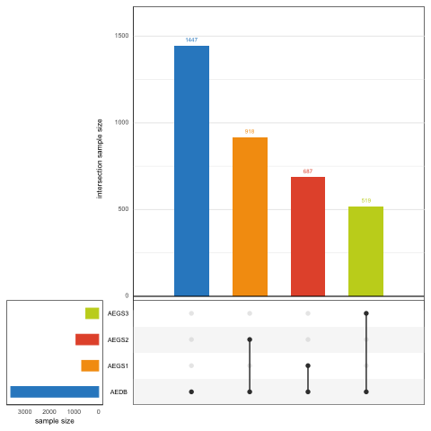
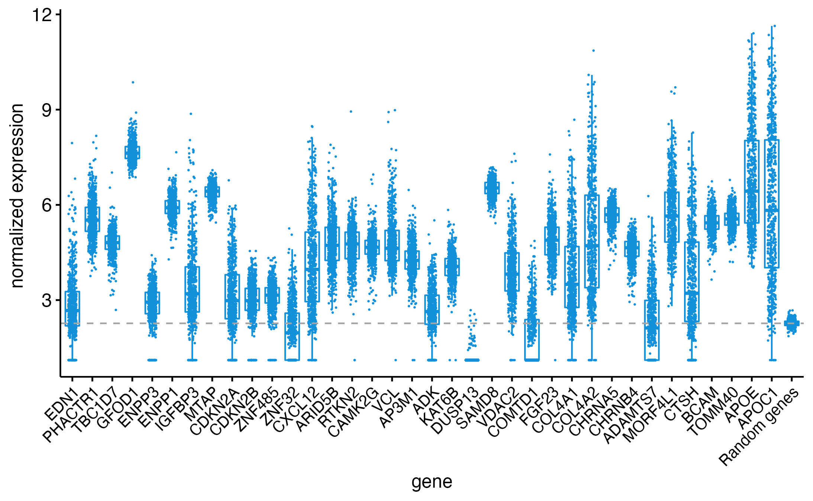
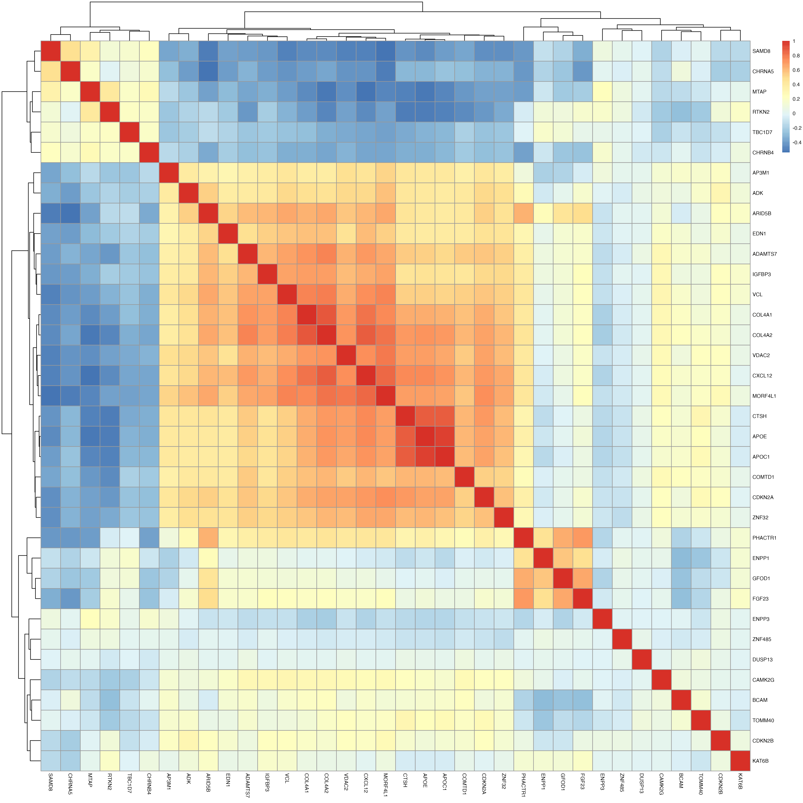
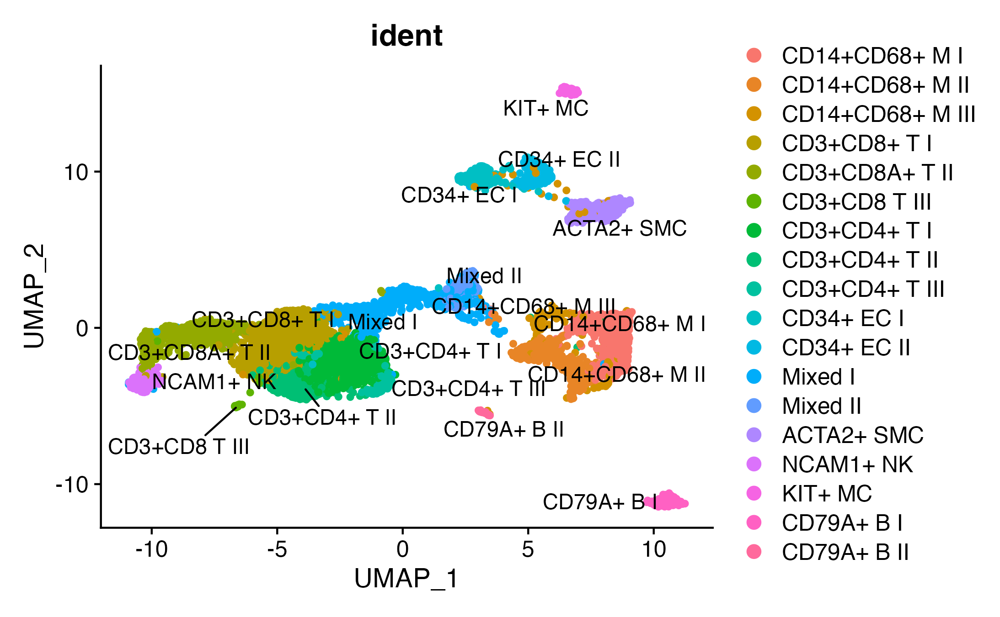
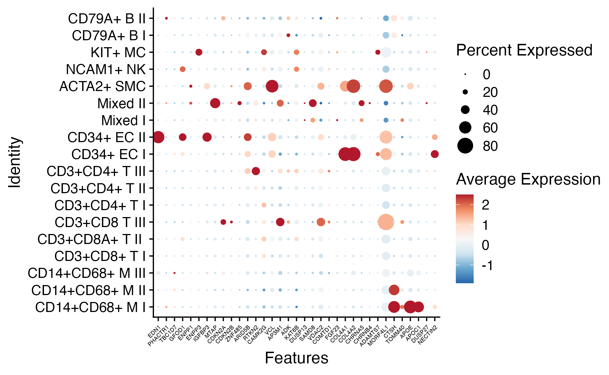
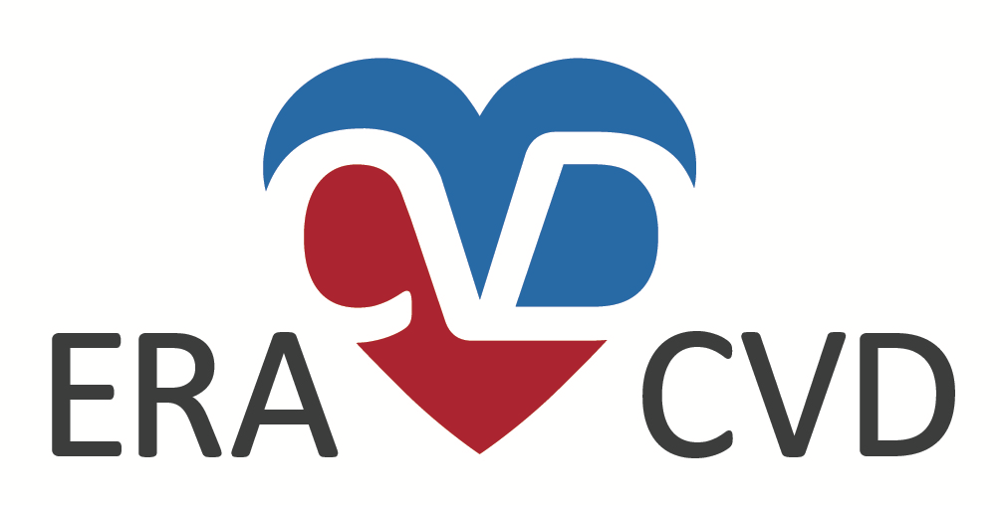
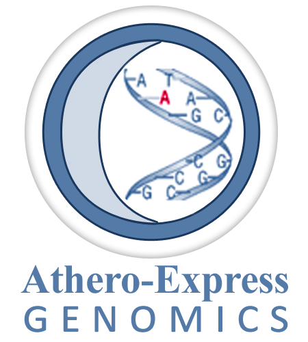

# Mapping CAC susceptibility loci to atherosclerotic plaques

_Project ID_: `AE_20200512_COL_MKAVOUSI_MBOS_CHARGE_1000G_CAC`.

## Background
<!-- Please add a brief introduction to explain what the project is about    -->

Collaboration for mapping targets from the CHARGE Consortium 1000G GWAS on _coronary artery calcification (CAC)_ with Maryam Kavousi, Patricia Peyser, and Maxime Bos.

## Athero-Express Biobank Study
We have bulk RNAseq (n = 635 samples) and single-cell RNAseq data, genome-wide methylation (Illumina 450K) in n ± 600, as well as overlapping genetic data for ±2,100 individuals with extensive histological plaque characterisation. We will address the following questions:

- Gene expression correlated to characteristics of plaques?
- Where target genes expressed, which cell types? 
- Are any of the variants associated to plaque characteristics?

Ideally, we would like to map the variants to the expression and methylation data (molecular QTL mapping), but this is pending finalizing our molQTL mapping.

We expect new plasma-based OLINK data (for the 'TO_AITION' projecty) in Q4 2020. We agreed that we would keep this in mind, we could run some additional analyses when asked during the revision stage of the manuscript.

- Correlation of variants to proteins from the OLINK-platform

## Methods

### Mapping genes to single cells 

We will use the last dataset from the scRNAseq data, including 35 individuals, to project target genes. 

### Genetic analyses

For the genetic analyses we will perform regression analyses adjusted for age, sex (where applicable) and principal components. So, we will apply the following model:

model 1: `phenotype ~ age + sex + chip-used + PC1 + PC2 + year-of-surgery`

phenotypes are:

- `calcification`, coded `Calc.bin` no/minor vs. moderate/heavy staining
- `collagen`, coded `Collagen.bin` no/minor vs. moderate/heavy staining
- `fat10`, coded `Fat.bin_10` no/<10% fat vs. >10% fat
- `fat40`, coded `Fat.bin_40` no/<40% fat vs. >40% fat
- `intraplaque hemorrhage`, coded `IPH.bin` no vs. yes
- `macrophages (CD68)`, coded `macmean0` mean of computer-assisted calculation CD68+ region of interest
- `smooth muscle cells (alpha-actin)`, coded `smcmean0` mean of computer-assisted calculation SMA+ region of interest
- `intraplaque vessel density (CD34)`, coded `vessel_density` manually counted CD34+ cells per 3-4 hotspots
- `mast cells`, coded `Mast_cells_plaque` manually counted mast cell tryptase+ cells (https://academic.oup.com/eurheartj/article/34/48/3699/484981)
- `neutrophils (CD66b)`, coded `neutrophils` manually counted CD66b+ cells (https://pubmed.ncbi.nlm.nih.gov/20595650/)

Continuous variables were inverse-rank normal transformated, indicated by `_rankNorm`. 

**Figure 1: Genotyped individuals in the Athero-Express Biobank Study**

### Gene expression

#### Whole-plaque RNAseq

For the expression analysis we used carotid plaque-derived bulk RNAseq data and queried it for the gene list. Below a graph showing the overall expression of the genes (not all are in the data) compared to the mean expression of 1,000 randomly picked genes. 

**Figure 2: Overall expression of target genes in carotid plaques from the Athero-Express Biobank Study**

**Figure 3: Correlation between target genes in carotid plaques from the Athero-Express Biobank Study**

We assessed the correlation with plaque characteristics (mentioned above) and secondary major adverse cardiovascular events (MACE [major]) at 30 days and 3 years after CEA. 

#### Single cell RNAseq

We projected target genes to the single-cell RNAseq data derived from 37 carotid plaque samples. We identified cell communities (Figure 2), mapped and projected target gene expression to the cell communities (Figure 3). 

**Figure 4: Cell communities identified in carotid plaques from the Athero-Express Biobank Study**

**Figure 5: Dotplot showing expression of target genes per cell type in carotid plaques from the Athero-Express Biobank Study**

## Where do I start?

You can load this project in RStudio by opening the file called 'AE_20200512_COL_MKAVOUSI_MBOS_CHARGE_1000G_CAC.Rproj'.

## Project structure

<!--  You can add rows to this table, using "|" to separate columns.         -->
File                                                 | Description                            | Usage         
---------------------------------------------------- | -------------------------------------- | --------------
README.md                                            | Description of project                 | Human editable
LICENSE                                              | User permissions                       | Read only     
.worcs                                               | WORCS metadata YAML                    | Read only     
renv.lock                                            | Reproducible R environment             | Read only     
images                                               | Images directory                       | Human editable
scripts                                              | Script to process some things          | Human editable
bulkRNAseq                                           | Bulk RNAseq scripts and results        | Human editable
CAC                                                  | General results                        | Human editable
CredibleSets                                         | The credible sets used                 | Human editable
scRNAseq                                             | Single-cell RNAseq scripts and results | Human editable
SNP                                                  | SNP analyses scripts and results       | Human editable
Parsing_GWASSumStats                                 | Creating regional assoc. plots         | Human editable
AE_20200512_COL_MKAVOUSI_MBOS_CHARGE_1000G_CAC       | Script to process raw data             | Human editable
AE_20200512_COL_MKAVOUSI_MBOS_CHARGE_1000G_CAC.Rproj | Project file                           | Loads project 

<!--  You can consider adding the following to this file:                    -->
<!--  * A citation reference for your project                                -->
<!--  * Contact information for questions/comments                           -->
<!--  * How people can offer to contribute to the project                    -->
<!--  * A contributor code of conduct, https://www.contributor-covenant.org/ -->

# Reproducibility

This project uses the Workflow for Open Reproducible Code in Science (WORCS) to
ensure transparency and reproducibility. The workflow is designed to meet the
principles of Open Science throughout a research project. 

To learn how WORCS helps researchers meet the TOP-guidelines and FAIR principles,
read the preprint at https://osf.io/zcvbs/

## WORCS: Advice for authors

* To get started with `worcs`, see the [setup vignette](https://cjvanlissa.github.io/worcs/articles/setup.html)
* For detailed information about the steps of the WORCS workflow, see the [workflow vignette](https://cjvanlissa.github.io/worcs/articles/workflow.html)

## WORCS: Advice for readers

Please refer to the vignette on [reproducing a WORCS project]() for step by step advice.
<!-- If your project deviates from the steps outlined in the vignette on     -->
<!-- reproducing a WORCS project, please provide your own advice for         -->
<!-- readers here.                                                           -->

# Acknowledgements

Dr. Sander W. van der Laan is funded through grants from the Netherlands CardioVascular Research Initiative of the Netherlands Heart Foundation (CVON 2011/B019 and CVON 2017-20: Generating the best evidence-based pharmaceutical targets for atherosclerosis [GENIUS I&II]). We are thankful for the support of the ERA-CVD program ‘druggable-MI-targets’ (grant number: 01KL1802), the EU H2020 TO_AITION (grant number: 848146), and the Leducq Fondation ‘PlaqOmics’.

Plaque samples are derived from carotid endarterectomies as part of the [Athero-Express Biobank Study](http:www/atheroexpress.nl) which is an ongoing study in the UMC Utrecht.

The framework was based on the [`WORCS` package](https://osf.io/zcvbs/).

  
  
 

#### Changes log

    Version:      v1.0.7
    Last update:  2021-12-14
    Written by:   Sander W. van der Laan (s.w.vanderlaan-2[at]umcutrecht.nl).
    Description:  Script to get some Athero-Express Biobank Study baseline characteristics.
    Minimum requirements: R version 3.4.3 (2017-06-30) -- 'Single Candle', Mac OS X El Capitan
    
    Changes log
    * v1.0.7 Update to the count data.
    * v1.0.6 Update to WORCS framework.
    * v1.0.6 Update code and fix coding of plaque vulnerability index (PVI) to work with SNPTEST.
    * v1.0.5 Updates to the gene list.
    * v1.0.4 Updates to the gene list.
    * v1.0.3 Update to the gene list.
    * v1.0.2 Updated baseline characteristics information. Update GWASToolKit preparation. Added more candidate SNPs to look at. Updated some variable names. 
    * v1.0.1 Add an additional phenotype.
    * v1.0.0 Initial version. Fixed baseline table, added codes, and results. Created sample-files.
    
    
--------------

#### The MIT License (MIT)
##### Copyright (c) 1979-2021 Sander W. van der Laan | s.w.vanderlaan [at] gmail [dot] com.

Permission is hereby granted, free of charge, to any person obtaining a copy of this software and associated documentation files (the "Software"), to deal in the Software without restriction, including without limitation the rights to use, copy, modify, merge, publish, distribute, sublicense, and/or sell copies of the Software, and to permit persons to whom the Software is furnished to do so, subject to the following conditions:   

The above copyright notice and this permission notice shall be included in all copies or substantial portions of the Software.

THE SOFTWARE IS PROVIDED "AS IS", WITHOUT WARRANTY OF ANY KIND, EXPRESS OR IMPLIED, INCLUDING BUT NOT LIMITED TO THE WARRANTIES OF MERCHANTABILITY, FITNESS FOR A PARTICULAR PURPOSE AND NONINFRINGEMENT. IN NO EVENT SHALL THE AUTHORS OR COPYRIGHT HOLDERS BE LIABLE FOR ANY CLAIM, DAMAGES OR OTHER LIABILITY, WHETHER IN AN ACTION OF CONTRACT, TORT OR OTHERWISE, ARISING FROM, OUT OF OR IN CONNECTION WITH THE SOFTWARE OR THE USE OR OTHER DEALINGS IN THE SOFTWARE.

Reference: http://opensource.org.

